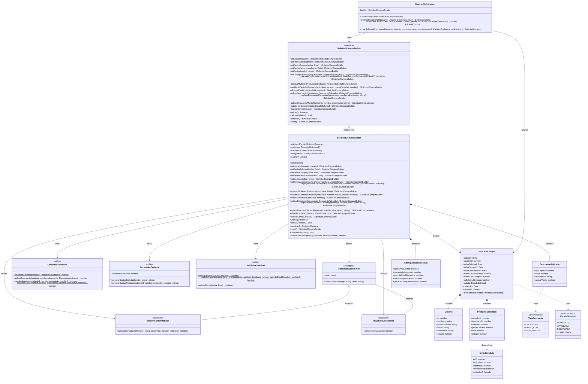

```mermaid
classDiagram
    %% Interfaces y DTOs principales
    class ISolicitudCompraBuilder {
        <<interface>>
        +setUsuario(usuario: Usuario) ISolicitudCompraBuilder
        +setFechaSolicitud(fecha: Date) ISolicitudCompraBuilder
        +setFechaCompra(fecha: Date) ISolicitudCompraBuilder
        +setFechaFacturacion(fecha: Date) ISolicitudCompraBuilder
        +setCodigo(codigo: string) ISolicitudCompraBuilder
        +setConfiguracion(config: Partial~ConfiguracionSolicitud~) ISolicitudCompraBuilder
        +agregarProducto(inventario: InventarioData, cantidad: number, precioUnitario?: number) ISolicitudCompraBuilder
        +agregarMultiplesProductos(productos: Array) ISolicitudCompraBuilder
        +modificarCantidadProducto(articuloId: number, nuevaCantidad: number) ISolicitudCompraBuilder
        +eliminarProducto(articuloId: number) ISolicitudCompraBuilder
        +aplicarDescuento(descuento: DescuentoAplicado) ISolicitudCompraBuilder
        +aplicarDescuentoPorcentaje(porcentaje: number, descripcion: string) ISolicitudCompraBuilder
        +aplicarDescuentoMontoFijo(monto: number, descripcion: string) ISolicitudCompraBuilder
        +establecerEstado(estado: EstadoSolicitud) ISolicitudCompraBuilder
        +marcarComoCerrada() ISolicitudCompraBuilder
        +validar() boolean
        +calcularTotales() void
        +construir() SolicitudCompra
        +reset() ISolicitudCompraBuilder
    }

    %% Builder concreto
    class SolicitudCompraBuilder {
        -solicitud: Partial~SolicitudCompra~
        -productos: ProductoSolicitado[]
        -descuentos: DescuentoAplicado[]
        -configuracion: ConfiguracionSolicitud
        -usuario?: Usuario
        +constructor()
        +setUsuario(usuario: Usuario) ISolicitudCompraBuilder
        +setFechaSolicitud(fecha: Date) ISolicitudCompraBuilder
        +setFechaCompra(fecha: Date) ISolicitudCompraBuilder
        +setFechaFacturacion(fecha: Date) ISolicitudCompraBuilder
        +setCodigo(codigo: string) ISolicitudCompraBuilder
        +setConfiguracion(config: Partial~ConfiguracionSolicitud~) ISolicitudCompraBuilder
        +agregarProducto(inventario: InventarioData, cantidad: number, precioUnitario?: number) ISolicitudCompraBuilder
        +agregarMultiplesProductos(productos: Array) ISolicitudCompraBuilder
        +modificarCantidadProducto(articuloId: number, nuevaCantidad: number) ISolicitudCompraBuilder
        +eliminarProducto(articuloId: number) ISolicitudCompraBuilder
        +aplicarDescuento(descuento: DescuentoAplicado) ISolicitudCompraBuilder
        +aplicarDescuentoPorcentaje(porcentaje: number, descripcion: string) ISolicitudCompraBuilder
        +aplicarDescuentoMontoFijo(monto: number, descripcion: string) ISolicitudCompraBuilder
        +establecerEstado(estado: EstadoSolicitud) ISolicitudCompraBuilder
        +marcarComoCerrada() ISolicitudCompraBuilder
        +validar() boolean
        +calcularTotales() void
        +construir() SolicitudCompra
        +reset() ISolicitudCompraBuilder
        +obtenerResumen() any
        -calcularPrecioSugerido(inventario: InventarioData) number
    }

    %% Director
    class DirectorSolicitudes {
        -builder: ISolicitudCompraBuilder
        +constructor(builder: ISolicitudCompraBuilder)
        +crearSolicitudSimple(usuario: Usuario, productos: Array) SolicitudCompra
        +crearSolicitudConDescuento(usuario: Usuario, productos: Array, porcentajeDescuento: number) SolicitudCompra
        +crearSolicitudEmpresarial(usuario: Usuario, productos: Array, configuracion?: Partial~ConfiguracionSolicitud~) SolicitudCompra
    }

    %% Producto final
    class SolicitudCompra {
        +codigo?: string
        +usuarioId: number
        +fechaSolicitud: Date
        +fechaCompra?: Date
        +fechaFacturacion?: Date
        +montoTotalSolicitado: number
        +montoTotalCompra: number
        +esSolicitudCerrada: boolean
        +estado: EstadoSolicitud
        +creadoEn: Date
        +usuario?: Usuario
        +productosSolicitados: ProductoSolicitado[]
    }

    %% Clases de apoyo
    class CalculadoraPrecios {
        <<utility>>
        +calcularSubtotal(productos: ProductoSolicitado[])$ number
        +aplicarDescuento(subtotal: number, descuento: DescuentoAplicado)$ number
        +calcularImpuestos(subtotal: number, porcentaje: number)$ number
        +calcularTotal(subtotal: number, descuentos: number, impuestos: number)$ number
    }

    class GeneradorCodigos {
        <<utility>>
        -contadorSolicitudes: number
        +generarCodigoSolicitud(prefijo: string)$ string
        +generarCodigoProducto(articuloId: number, solicitudId: number)$ string
    }

    class ValidadorSolicitud {
        <<utility>>
        +validarUsuario(usuario: Usuario)$ boolean
        +validarInventario(inventario: InventarioData, cantidadSolicitada: number, permitirStockNegativo: boolean)$ boolean
        +validarFecha(fecha: Date)$ boolean
    }

    %% Excepciones
    class SolicitudBuilderError {
        <<exception>>
        +code: string
        +constructor(message: string, code: string)
    }

    class StockInsuficienteError {
        <<exception>>
        +constructor(articuloNombre: string, disponible: number, solicitado: number)
    }

    class UsuarioInvalidoError {
        <<exception>>
        +constructor(usuarioId: number)
    }

    %% DTOs y entidades
    class Usuario {
        +id: number
        +nombres: string
        +primerApellido: string
        +email: string
        +userName: string
        +estado: number
    }

    class InventarioData {
        +id?: number
        +articuloId: number
        +cantidad?: number
        +esVisibleMp: boolean
        +articulos?: Articulo
    }

    class ProductoSolicitado {
        +articuloId: number
        +inventarioId: number
        +cantidad: number
        +precioUnitario: number
        +total: number
        +estado: number
    }

    class DescuentoAplicado {
        +tipo: TipoDescuento
        +valor: number
        +descripcion: string
        +aplicaATodo: boolean
    }

    class ConfiguracionSolicitud {
        +aplicarImpuestos: boolean
        +porcentajeImpuesto: number
        +permitirStockNegativo: boolean
        +validarDisponibilidad: boolean
        +generarCodigoAutomatico: boolean
    }

    %% Enums
    class TipoDescuento {
        <<enumeration>>
        PORCENTAJE
        MONTO_FIJO
        ENVIO_GRATIS
    }

    class EstadoSolicitud {
        <<enumeration>>
        PENDIENTE
        APROBADA
        RECHAZADA
        COMPLETADA
    }

    %% Relaciones principales del patrón Builder
    ISolicitudCompraBuilder <|-- SolicitudCompraBuilder : implements
    DirectorSolicitudes --> ISolicitudCompraBuilder : uses
    SolicitudCompraBuilder --> SolicitudCompra : creates
    DirectorSolicitudes --> SolicitudCompra : returns

    %% Relaciones de uso
    SolicitudCompraBuilder --> CalculadoraPrecios : uses
    SolicitudCompraBuilder --> GeneradorCodigos : uses
    SolicitudCompraBuilder --> ValidadorSolicitud : uses
    SolicitudCompraBuilder --> SolicitudBuilderError : throws
    SolicitudCompraBuilder --> StockInsuficienteError : throws
    SolicitudCompraBuilder --> UsuarioInvalidoError : throws

    %% Relaciones de agregación/composición
    SolicitudCompra *-- ProductoSolicitado : contains
    SolicitudCompra *-- Usuario : contains
    SolicitudCompraBuilder *-- DescuentoAplicado : contains
    SolicitudCompraBuilder *-- ConfiguracionSolicitud : contains

    %% Relaciones de dependencia
    ProductoSolicitado ..> InventarioData : depends on
    DescuentoAplicado ..> TipoDescuento : uses
    SolicitudCompra ..> EstadoSolicitud : uses

    %% Herencia de excepciones
    SolicitudBuilderError <|-- StockInsuficienteError : extends
    SolicitudBuilderError <|-- UsuarioInvalidoError : extends
```
