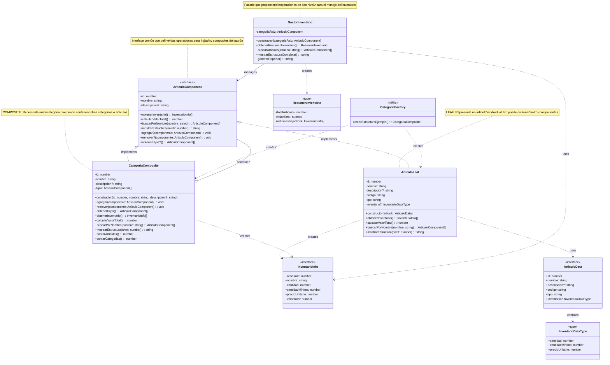

```mermaid
classDiagram
    %% Interfaces y tipos de datos
    class ArticuloComponent {
        <<interface>>
        +id: number
        +nombre: string
        +descripcion?: string
        +obtenerInventario(): InventarioInfo[]
        +calcularValorTotal(): number
        +buscarPorNombre(nombre: string): ArticuloComponent[]
        +mostrarEstructura(nivel?: number): string
        +agregar?(componente: ArticuloComponent): void
        +remover?(componente: ArticuloComponent): void
        +obtenerHijos?(): ArticuloComponent[]
    }

    class InventarioInfo {
        <<interface>>
        +articuloId: number
        +nombre: string
        +cantidad: number
        +cantidadMinima: number
        +precioUnitario: number
        +valorTotal: number
    }

    class ArticuloData {
        <<interface>>
        +id: number
        +nombre: string
        +descripcion?: string
        +codigo: string
        +tipo: string
        +inventario?: InventarioDataType
    }

    class InventarioDataType {
        <<type>>
        +cantidad: number
        +cantidadMinima: number
        +precioUnitario: number
    }

    %% Clase Leaf
    class ArticuloLeaf {
        -id: number
        -nombre: string
        -descripcion?: string
        -codigo: string
        -tipo: string
        -inventario?: InventarioDataType
        +constructor(articulo: ArticuloData)
        +obtenerInventario(): InventarioInfo[]
        +calcularValorTotal(): number
        +buscarPorNombre(nombre: string): ArticuloComponent[]
        +mostrarEstructura(nivel: number): string
    }

    %% Clase Composite
    class CategoriaComposite {
        -id: number
        -nombre: string
        -descripcion?: string
        -hijos: ArticuloComponent[]
        +constructor(id: number, nombre: string, descripcion?: string)
        +agregar(componente: ArticuloComponent): void
        +remover(componente: ArticuloComponent): void
        +obtenerHijos(): ArticuloComponent[]
        +obtenerInventario(): InventarioInfo[]
        +calcularValorTotal(): number
        +buscarPorNombre(nombre: string): ArticuloComponent[]
        +mostrarEstructura(nivel: number): string
        +contarArticulos(): number
        +contarCategorias(): number
    }

    %% Factory Pattern
    class CategoriaFactory {
        <<utility>>
        +crearEstructuraEjemplo(): CategoriaComposite
    }

    %% Gestor de Inventario
    class GestorInventario {
        -categoriaRaiz: ArticuloComponent
        +constructor(categoriaRaiz: ArticuloComponent)
        +obtenerResumenInventario(): ResumenInventario
        +buscarArticulos(termino: string): ArticuloComponent[]
        +mostrarEstructuraCompleta(): string
        +generarReporte(): string
    }

    class ResumenInventario {
        <<type>>
        +totalArticulos: number
        +valorTotal: number
        +articulosBajoStock: InventarioInfo[]
    }

    %% Relaciones del patrón Composite
    ArticuloComponent <|.. ArticuloLeaf : implements
    ArticuloComponent <|.. CategoriaComposite : implements
    CategoriaComposite o-- ArticuloComponent : contains *

    %% Relaciones de dependencia
    ArticuloLeaf ..> ArticuloData : uses
    ArticuloLeaf ..> InventarioInfo : creates
    ArticuloData ..> InventarioDataType : contains

    CategoriaComposite ..> InventarioInfo : creates
    CategoriaFactory ..> CategoriaComposite : creates
    CategoriaFactory ..> ArticuloLeaf : creates

    GestorInventario --> ArticuloComponent : manages
    GestorInventario ..> ResumenInventario : creates
    GestorInventario ..> InventarioInfo : uses

    %% Notas explicativas
    note for ArticuloComponent "Interface común que define\nlas operaciones para hojas\ny composites del patrón"

    note for ArticuloLeaf "LEAF: Representa un artículo\nindividual. No puede contener\notros componentes"

    note for CategoriaComposite "COMPOSITE: Representa una\ncategoría que puede contener\notras categorías o artículos"

    note for GestorInventario "Facade que proporciona\noperaciones de alto nivel\npara el manejo del inventario"
```
