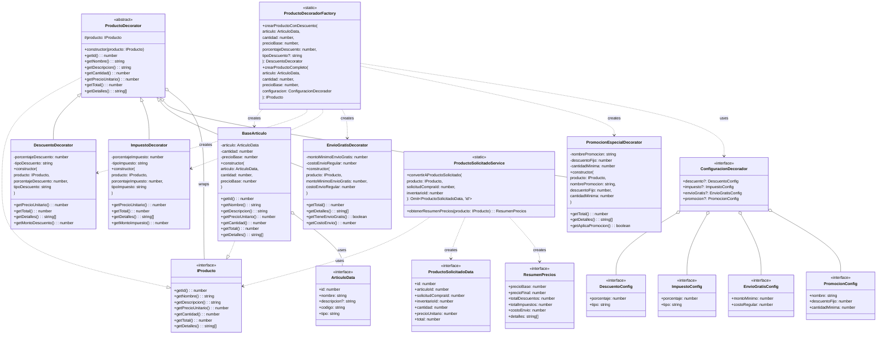

```mermaid
classDiagram
    %% Interfaces y tipos base
    class ArticuloData {
        <<interface>>
        +id: number
        +nombre: string
        +descripcion?: string
        +codigo: string
        +tipo: string
    }

    class ProductoSolicitadoData {
        <<interface>>
        +id: number
        +articuloId: number
        +solicitudCompraId: number
        +inventarioId: number
        +cantidad: number
        +precioUnitario: number
        +total: number
    }

    %% Interfaz principal
    class IProducto {
        <<interface>>
        +getId(): number
        +getNombre(): string
        +getDescripcion(): string
        +getPrecioUnitario(): number
        +getCantidad(): number
        +getTotal(): number
        +getDetalles(): string[]
    }

    %% Clase base del producto
    class BaseArticulo {
        -articulo: ArticuloData
        -cantidad: number
        -precioBase: number
        +constructor(
            articulo: ArticuloData,
            cantidad: number,
            precioBase: number
        )
        +getId(): number
        +getNombre(): string
        +getDescripcion(): string
        +getPrecioUnitario(): number
        +getCantidad(): number
        +getTotal(): number
        +getDetalles(): string[]
    }

    %% Decorator base abstracto
    class ProductoDecorator {
        <<abstract>>
        #producto: IProducto
        +constructor(producto: IProducto)
        +getId(): number
        +getNombre(): string
        +getDescripcion(): string
        +getCantidad(): number
        +getPrecioUnitario(): number
        +getTotal(): number
        +getDetalles(): string[]
    }

    %% Decoradores concretos
    class DescuentoDecorator {
        -porcentajeDescuento: number
        -tipoDescuento: string
        +constructor(
            producto: IProducto,
            porcentajeDescuento: number,
            tipoDescuento: string
        )
        +getPrecioUnitario(): number
        +getTotal(): number
        +getDetalles(): string[]
        +getMontoDescuento(): number
    }

    class ImpuestoDecorator {
        -porcentajeImpuesto: number
        -tipoImpuesto: string
        +constructor(
            producto: IProducto,
            porcentajeImpuesto: number,
            tipoImpuesto: string
        )
        +getPrecioUnitario(): number
        +getTotal(): number
        +getDetalles(): string[]
        +getMontoImpuesto(): number
    }

    class EnvioGratisDecorator {
        -montoMinimoEnvioGratis: number
        -costoEnvioRegular: number
        +constructor(
            producto: IProducto,
            montoMinimoEnvioGratis: number,
            costoEnvioRegular: number
        )
        +getTotal(): number
        +getDetalles(): string[]
        +getTieneEnvioGratis(): boolean
        +getCostoEnvio(): number
    }

    class PromocionEspecialDecorator {
        -nombrePromocion: string
        -descuentoFijo: number
        -cantidadMinima: number
        +constructor(
            producto: IProducto,
            nombrePromocion: string,
            descuentoFijo: number,
            cantidadMinima: number
        )
        +getTotal(): number
        +getDetalles(): string[]
        +getAplicaPromocion(): boolean
    }

    %% Factory para crear productos
    class ProductoDecoradorFactory {
        <<static>>
        +crearProductoConDescuento(
            articulo: ArticuloData,
            cantidad: number,
            precioBase: number,
            porcentajeDescuento: number,
            tipoDescuento?: string
        ): DescuentoDecorator
        +crearProductoCompleto(
            articulo: ArticuloData,
            cantidad: number,
            precioBase: number,
            configuracion: ConfiguracionDecorador
        ): IProducto
    }

    class ConfiguracionDecorador {
        <<interface>>
        +descuento?: DescuentoConfig
        +impuesto?: ImpuestoConfig
        +envioGratis?: EnvioGratisConfig
        +promocion?: PromocionConfig
    }

    class DescuentoConfig {
        <<interface>>
        +porcentaje: number
        +tipo: string
    }

    class ImpuestoConfig {
        <<interface>>
        +porcentaje: number
        +tipo: string
    }

    class EnvioGratisConfig {
        <<interface>>
        +montoMinimo: number
        +costoRegular: number
    }

    class PromocionConfig {
        <<interface>>
        +nombre: string
        +descuentoFijo: number
        +cantidadMinima: number
    }

    %% Servicio de integración con Prisma
    class ProductoSolicitadoService {
        <<static>>
        +convertirAProductoSolicitado(
            producto: IProducto,
            solicitudCompraId: number,
            inventarioId: number
        ): Omit~ProductoSolicitadoData, 'id'~
        +obtenerResumenPrecios(producto: IProducto): ResumenPrecios
    }

    class ResumenPrecios {
        <<interface>>
        +precioBase: number
        +precioFinal: number
        +totalDescuentos: number
        +totalImpuestos: number
        +costoEnvio: number
        +detalles: string[]
    }

    %% Relaciones de implementación e herencia
    BaseArticulo ..|> IProducto
    ProductoDecorator ..|> IProducto
    ProductoDecorator <|-- DescuentoDecorator
    ProductoDecorator <|-- ImpuestoDecorator
    ProductoDecorator <|-- EnvioGratisDecorator
    ProductoDecorator <|-- PromocionEspecialDecorator

    %% Relaciones de composición
    ProductoDecorator o-- IProducto : wraps
    BaseArticulo o-- ArticuloData : uses

    %% Relaciones de dependencia
    ProductoDecoradorFactory ..> BaseArticulo : creates
    ProductoDecoradorFactory ..> DescuentoDecorator : creates
    ProductoDecoradorFactory ..> ImpuestoDecorator : creates
    ProductoDecoradorFactory ..> EnvioGratisDecorator : creates
    ProductoDecoradorFactory ..> PromocionEspecialDecorator : creates
    ProductoDecoradorFactory ..> ConfiguracionDecorador : uses

    ProductoSolicitadoService ..> IProducto : uses
    ProductoSolicitadoService ..> ProductoSolicitadoData : creates
    ProductoSolicitadoService ..> ResumenPrecios : creates

    %% Configuraciones relacionadas
    ConfiguracionDecorador o-- DescuentoConfig
    ConfiguracionDecorador o-- ImpuestoConfig
    ConfiguracionDecorador o-- EnvioGratisConfig
    ConfiguracionDecorador o-- PromocionConfig


```
