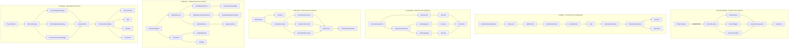

```mermaid
%% PATRONES CREACIONALES

graph TD
    %% 1. Factory Method - Para crear diferentes tipos de productos
    subgraph "1 Factory Method - Creación de Productos"
        A[ProductFactory] -->|createProduct| B[ArticuloFactory]
        B --> C[ArticuloFisico]
        B --> D[ArticuloDigital]
        B --> E[ArticuloPerecible]

        C --> F[productosIngresados]
        D --> F
        E --> F

        F --> G[inventarios]
    end

    %% 2. Builder - Para construir solicitudes de compra complejas
    subgraph "2 Builder - Construcción de Solicitudes"
        H[SolicitudCompraBuilder] --> I[setUsuario]
        I --> J[addProducto]
        J --> K[setFechaSolicitud]
        K --> L[calculateTotal]
        L --> M[build]

        M --> N[solicitudesCompras]
        N --> O[ProductosSolicitados]
        O --> P[articulos]
        O --> Q[inventarios]
    end

    %% PATRONES ESTRUCTURALES

    %% 3. Composite - Para manejar categorías y subcategorías de artículos
    subgraph "3 Composite - Estructura de Categorías"
        R[ArticuloComponent] --> S[ArticuloLeaf]
        R --> T[CategoriaComposite]

        S --> U[articulos]
        T --> V[SubCategoria1]
        T --> W[SubCategoria2]
        V --> X[articulos]
        W --> Y[articulos]

        U --> Z[inventarios]
        X --> Z
        Y --> Z
    end

    %% 4. Decorator - Para agregar funcionalidades a productos
    subgraph "4 Decorator - Extensión de Productos"
        AA[BaseArticulo] --> BB[articulos]
        AA --> CC[ArticuloDecorator]

        CC --> DD[DescuentoDecorator]
        CC --> EE[ImpuestoDecorator]
        CC --> FF[EnvioGratisDecorator]

        DD --> GG[PrecioFinal]
        EE --> GG
        FF --> GG

        GG --> HH[ProductosSolicitados]
    end

    %% PATRONES DE COMPORTAMIENTO

    %% 5. Observer - Para notificaciones de inventario
    subgraph "5 Observer - Notificaciones de Inventario"
        II[InventarioSubject] --> JJ[inventarios]
        II --> KK[notifyObservers]

        KK --> LL[StockBajoObserver]
        KK --> MM[ReabastecimientoObserver]
        KK --> NN[VentasObserver]

        LL --> OO[NotificacionStockBajo]
        MM --> PP[SolicitudReabastecimiento]
        NN --> QQ[ReporteVentas]

        JJ --> RR[cantidadMinima]
        JJ --> SS[cantidad]
    end

    %% 6. Strategy - Para diferentes estrategias de cálculo de precios
    subgraph "6 Strategy - Estrategias de Precios"
        TT[PrecioContext] --> UU[IPrecioStrategy]

        UU --> VV[PrecioRegularStrategy]
        UU --> WW[PrecioMayoristaStrategy]
        UU --> XX[PrecioPromocionalStrategy]

        VV --> YY[calcularPrecio]
        WW --> YY
        XX --> YY

        YY --> ZZ[ProductosSolicitados]
        ZZ --> AAA[precioUnitario]
        ZZ --> BBB[total]

        ZZ --> CCC[articulos]
        ZZ --> DDD[inventarios]
    end
```
