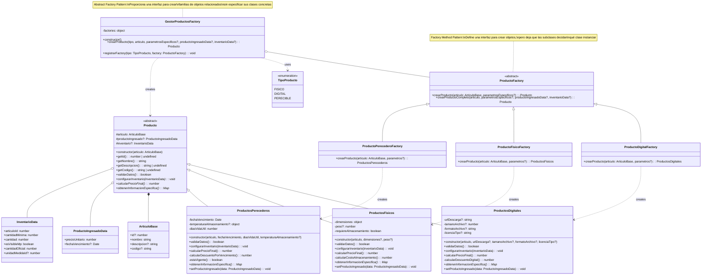

```mermaid
classDiagram
    %% Enumeración de tipos de producto
    class TipoProducto {
        <<enumeration>>
        FISICO
        DIGITAL
        PERECIBLE
    }

    %% Interfaces/DTOs
    class ArticuloBase {
        +id?: number
        +nombre: string
        +descripcion?: string
        +codigo?: string
    }

    class InventarioData {
        +articuloId: number
        +cantidadMinima: number
        +cantidad: number
        +esVisibleMp: boolean
        +cantidadOficial: number
        +unidadMedidaId?: number
    }

    class ProductoIngresadoData {
        +precioUnitario: number
        +fechaVencimiento?: Date
    }

    %% Clase abstracta Producto
    class Producto {
        <<abstract>>
        #articulo: ArticuloBase
        #productoIngresado?: ProductoIngresadoData
        #inventario?: InventarioData
        +constructor(articulo: ArticuloBase)
        +getId(): number | undefined
        +getNombre(): string
        +getDescripcion(): string | undefined
        +getCodigo(): string | undefined
        +validarDatos(): boolean*
        +configurarInventario(inventarioData): void*
        +calcularPrecioFinal(): number*
        +obtenerInformacionEspecifica(): Map*
    }

    %% Productos concretos
    class ProductosDigitales {
        -urlDescarga?: string
        -tamanoArchivo?: number
        -formatoArchivo?: string
        -licenciaTipo?: string
        +constructor(articulo, urlDescarga?, tamanoArchivo?, formatoArchivo?, licenciaTipo?)
        +validarDatos(): boolean
        +configurarInventario(inventarioData): void
        +calcularPrecioFinal(): number
        -calcularDescuentoDigital(): number
        +obtenerInformacionEspecifica(): Map*
        +setProductoIngresado(data: ProductoIngresadoData): void
    }

    class ProductosFisicos {
        -dimensiones: object
        -peso?: number
        -requiereAlmacenamiento: boolean
        +constructor(articulo, dimensiones?, peso?)
        +validarDatos(): boolean
        +configurarInventario(inventarioData): void
        +calcularPrecioFinal(): number
        -calcularCostoAlmacenamiento(): number
        +obtenerInformacionEspecifica(): Map*
        +setProductoIngresado(data: ProductoIngresadoData): void
    }

    class ProductosPerecederos {
        -fechaVencimiento: Date
        -temperaturaAlmacenamiento?: object
        -diasVidaUtil: number
        +constructor(articulo, fechaVencimiento, diasVidaUtil, temperaturaAlmacenamiento?)
        +validarDatos(): boolean
        +configurarInventario(inventarioData): void
        +calcularPrecioFinal(): number
        -calcularDescuentoPorVencimiento(): number
        -estaVigente(): boolean
        +obtenerInformacionEspecifica(): Map*
        +setProductoIngresado(data: ProductoIngresadoData): void
    }

    %% Factory abstracto
    class ProductoFactory {
        <<abstract>>
        +crearProducto(articulo: ArticuloBase, parametrosEspecificos?): Producto*
        +crearProductoCompleto(articulo, parametrosEspecificos?, productoIngresadoData?, inventarioData?): Producto
    }

    %% Factories concretos
    class ProductoDigitalFactory {
        +crearProducto(articulo: ArticuloBase, parametros?): ProductosDigitales
    }

    class ProductoFisicoFactory {
        +crearProducto(articulo: ArticuloBase, parametros?): ProductosFisicos
    }

    class ProductoPerecederoFactory {
        +crearProducto(articulo: ArticuloBase, parametros?): ProductosPerecederos
    }

    %% Gestor de factories
    class GestorProductosFactory {
        -factories: object
        +constructor()
        +crearProducto(tipo, articulo, parametrosEspecificos?, productoIngresadoData?, inventarioData?): Producto
        +registrarFactory(tipo: TipoProducto, factory: ProductoFactory): void
    }

    %% Relaciones de herencia
    Producto <|-- ProductosDigitales
    Producto <|-- ProductosFisicos
    Producto <|-- ProductosPerecederos

    ProductoFactory <|-- ProductoDigitalFactory
    ProductoFactory <|-- ProductoFisicoFactory
    ProductoFactory <|-- ProductoPerecederoFactory

    %% Relaciones de composición y agregación
    Producto *-- ArticuloBase
    Producto o-- ProductoIngresadoData
    Producto o-- InventarioData

    %% Relaciones de dependencia
    ProductoDigitalFactory ..> ProductosDigitales : creates
    ProductoFisicoFactory ..> ProductosFisicos : creates
    ProductoPerecederoFactory ..> ProductosPerecederos : creates

    %% Gestor usa factories
    GestorProductosFactory o-- ProductoFactory
    GestorProductosFactory ..> TipoProducto : uses
    GestorProductosFactory ..> Producto : creates

    %% Notas sobre el patrón
    note for ProductoFactory "Factory Method Pattern:\nDefine una interfaz para crear objetos,\npero deja que las subclases decidan\nqué clase instanciar"

    note for GestorProductosFactory "Abstract Factory Pattern:\nProporciona una interfaz para crear\nfamilias de objetos relacionados\nsin especificar sus clases concretas"

```
