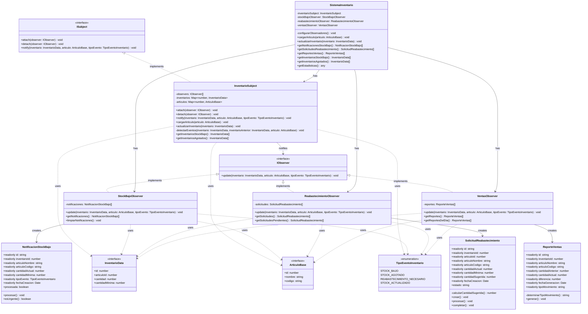

```mermaid
classDiagram
    %% Interfaces del patrón Observer
    class IObserver {
        <<interface>>
        +update(inventario: InventarioData, articulo: ArticuloBase, tipoEvento: TipoEventoInventario) void
    }

    class ISubject {
        <<interface>>
        +attach(observer: IObserver) void
        +detach(observer: IObserver) void
        +notify(inventario: InventarioData, articulo: ArticuloBase, tipoEvento: TipoEventoInventario) void
    }

    %% Subject concreto
    class InventarioSubject {
        -observers: IObserver[]
        -inventarios: Map~number, InventarioData~
        -articulos: Map~number, ArticuloBase~
        +attach(observer: IObserver) void
        +detach(observer: IObserver) void
        +notify(inventario: InventarioData, articulo: ArticuloBase, tipoEvento: TipoEventoInventario) void
        +cargarArticulo(articulo: ArticuloBase) void
        +actualizarInventario(inventario: InventarioData) void
        -detectarEventos(inventario: InventarioData, inventarioAnterior: InventarioData, articulo: ArticuloBase) void
        +getInventariosStockBajo() InventarioData[]
        +getInventariosAgotados() InventarioData[]
    }

    %% Observers concretos
    class StockBajoObserver {
        -notificaciones: NotificacionStockBajo[]
        +update(inventario: InventarioData, articulo: ArticuloBase, tipoEvento: TipoEventoInventario) void
        +getNotificaciones() NotificacionStockBajo[]
        +limpiarNotificaciones() void
    }

    class ReabastecimientoObserver {
        -solicitudes: SolicitudReabastecimiento[]
        +update(inventario: InventarioData, articulo: ArticuloBase, tipoEvento: TipoEventoInventario) void
        +getSolicitudes() SolicitudReabastecimiento[]
        +getSolicitudesPendientes() SolicitudReabastecimiento[]
    }

    class VentasObserver {
        -reportes: ReporteVentas[]
        +update(inventario: InventarioData, articulo: ArticuloBase, tipoEvento: TipoEventoInventario) void
        +getReportes() ReporteVentas[]
        +getReportesDelDia() ReporteVentas[]
    }

    %% Clases de datos/modelos
    class NotificacionStockBajo {
        +readonly id: string
        +readonly inventarioId: number
        +readonly articuloNombre: string
        +readonly articuloCodigo: string
        +readonly cantidadActual: number
        +readonly cantidadMinima: number
        +readonly tipoEvento: TipoEventoInventario
        +readonly fechaCreacion: Date
        +procesada: boolean
        +procesar() void
        +esUrgente() boolean
    }

    class SolicitudReabastecimiento {
        +readonly id: string
        +readonly inventarioId: number
        +readonly articuloId: number
        +readonly articuloNombre: string
        +readonly articuloCodigo: string
        +readonly cantidadActual: number
        +readonly cantidadMinima: number
        +readonly cantidadSugerida: number
        +readonly fechaCreacion: Date
        +estado: string
        -calcularCantidadSugerida() number
        +crear() void
        +procesar() void
        +completar() void
    }

    class ReporteVentas {
        +readonly id: string
        +readonly inventarioId: number
        +readonly articuloNombre: string
        +readonly articuloCodigo: string
        +readonly cantidadAnterior: number
        +readonly cantidadActual: number
        +readonly diferencia: number
        +readonly fechaGeneracion: Date
        +readonly tipoMovimiento: string
        -determinarTipoMovimiento() string
        +generar() void
    }

    %% Sistema principal
    class SistemaInventario {
        -inventarioSubject: InventarioSubject
        -stockBajoObserver: StockBajoObserver
        -reabastecimientoObserver: ReabastecimientoObserver
        -ventasObserver: VentasObserver
        -configurarObservadores() void
        +cargarArticulo(articulo: ArticuloBase) void
        +actualizarInventario(inventario: InventarioData) void
        +getNotificacionesStockBajo() NotificacionStockBajo[]
        +getSolicitudesReabastecimiento() SolicitudReabastecimiento[]
        +getReportesVentas() ReporteVentas[]
        +getInventariosStockBajo() InventarioData[]
        +getInventariosAgotados() InventarioData[]
        +getEstadisticas() any
    }

    %% Interfaces externas (DTOs)
    class InventarioData {
        <<interface>>
        +id: number
        +articuloId: number
        +cantidad: number
        +cantidadMinima: number
    }

    class ArticuloBase {
        <<interface>>
        +id: number
        +nombre: string
        +codigo: string
    }

    class TipoEventoInventario {
        <<enumeration>>
        STOCK_BAJO
        STOCK_AGOTADO
        REABASTECIMIENTO_NECESARIO
        STOCK_ACTUALIZADO
    }

    %% Relaciones del patrón Observer
    ISubject <|.. InventarioSubject : implements
    IObserver <|.. StockBajoObserver : implements
    IObserver <|.. ReabastecimientoObserver : implements
    IObserver <|.. VentasObserver : implements

    %% Relaciones de composición y agregación
    InventarioSubject --> IObserver : notifies
    StockBajoObserver --> NotificacionStockBajo : creates
    ReabastecimientoObserver --> SolicitudReabastecimiento : creates
    VentasObserver --> ReporteVentas : creates

    %% Relaciones del sistema principal
    SistemaInventario --> InventarioSubject : has
    SistemaInventario --> StockBajoObserver : has
    SistemaInventario --> ReabastecimientoObserver : has
    SistemaInventario --> VentasObserver : has

    %% Dependencias de datos
    InventarioSubject ..> InventarioData : uses
    InventarioSubject ..> ArticuloBase : uses
    InventarioSubject ..> TipoEventoInventario : uses

    StockBajoObserver ..> InventarioData : uses
    StockBajoObserver ..> ArticuloBase : uses
    StockBajoObserver ..> TipoEventoInventario : uses

    ReabastecimientoObserver ..> InventarioData : uses
    ReabastecimientoObserver ..> ArticuloBase : uses
    ReabastecimientoObserver ..> TipoEventoInventario : uses

    VentasObserver ..> InventarioData : uses
    VentasObserver ..> ArticuloBase : uses
    VentasObserver ..> TipoEventoInventario : uses
```
