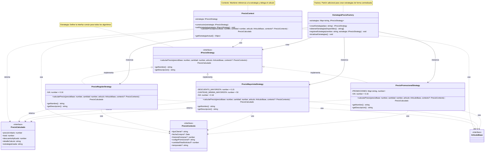

```mermaid
classDiagram
    %% Interfaces principales
    class IPrecioStrategy {
        <<interface>>
        +calcularPrecio(precioBase: number, cantidad: number, articulo: ArticuloBase, contexto?: PrecioContexto) PrecioCalculado
        +getNombre() string
        +getDescripcion() string
    }

    class PrecioCalculado {
        <<interface>>
        +precioUnitario: number
        +total: number
        +descuentoAplicado: number
        +detalleCalculo: string
        +estrategiaUsada: string
    }

    class PrecioContexto {
        <<interface>>
        +tipoCliente?: string
        +fechaCompra?: Date
        +historialCompras?: number
        +codigoPromocional?: string
        +cantidadTotalSolicitud?: number
        +temporada?: string
    }

    class ArticuloBase {
        <<interface>>
        %% Propiedades definidas en shared/dto/interface
    }

    %% Contexto del patrón Strategy
    class PrecioContext {
        -estrategia: IPrecioStrategy
        +constructor(estrategia: IPrecioStrategy)
        +setEstrategia(estrategia: IPrecioStrategy) void
        +calcularPrecio(precioBase: number, cantidad: number, articulo: ArticuloBase, contexto?: PrecioContexto) PrecioCalculado
        +getEstrategiaActual() Object
    }

    %% Estrategias concretas
    class PrecioRegularStrategy {
        -IVA: number = 0.16
        +calcularPrecio(precioBase: number, cantidad: number, articulo: ArticuloBase, contexto?: PrecioContexto) PrecioCalculado
        +getNombre() string
        +getDescripcion() string
    }

    class PrecioMayoristaStrategy {
        -DESCUENTO_MAYORISTA: number = 0.15
        -CANTIDAD_MINIMA_MAYORISTA: number = 50
        -IVA: number = 0.16
        +calcularPrecio(precioBase: number, cantidad: number, articulo: ArticuloBase, contexto?: PrecioContexto) PrecioCalculado
        +getNombre() string
        +getDescripcion() string
    }

    class PrecioPromocionalStrategy {
        -PROMOCIONES: Map~string, number~
        -IVA: number = 0.16
        +calcularPrecio(precioBase: number, cantidad: number, articulo: ArticuloBase, contexto?: PrecioContexto) PrecioCalculado
        +getNombre() string
        +getDescripcion() string
    }

    %% Factory para crear estrategias
    class EstrategiaPrecioFactory {
        -estrategias: Map~string, IPrecioStrategy~
        +crearEstrategia(tipo: string) IPrecioStrategy
        +obtenerEstrategiasDisponibles() string[]
        +registrarEstrategia(nombre: string, estrategia: IPrecioStrategy) void
        -inicializarEstrategias() void
    }

    %% Relaciones del patrón Strategy
    PrecioContext --> IPrecioStrategy : usa
    PrecioContext ..> PrecioCalculado : retorna
    PrecioContext ..> PrecioContexto : usa
    PrecioContext ..> ArticuloBase : usa

    %% Implementaciones de la estrategia
    IPrecioStrategy <|.. PrecioRegularStrategy : implementa
    IPrecioStrategy <|.. PrecioMayoristaStrategy : implementa
    IPrecioStrategy <|.. PrecioPromocionalStrategy : implementa

    %% Factory relationships
    EstrategiaPrecioFactory --> IPrecioStrategy : crea
    EstrategiaPrecioFactory --> PrecioRegularStrategy : instancia
    EstrategiaPrecioFactory --> PrecioMayoristaStrategy : instancia
    EstrategiaPrecioFactory --> PrecioPromocionalStrategy : instancia

    %% Dependencias de las estrategias
    PrecioRegularStrategy ..> PrecioCalculado : retorna
    PrecioMayoristaStrategy ..> PrecioCalculado : retorna
    PrecioPromocionalStrategy ..> PrecioCalculado : retorna

    PrecioRegularStrategy ..> PrecioContexto : usa
    PrecioMayoristaStrategy ..> PrecioContexto : usa
    PrecioPromocionalStrategy ..> PrecioContexto : usa

    PrecioRegularStrategy ..> ArticuloBase : usa
    PrecioMayoristaStrategy ..> ArticuloBase : usa
    PrecioPromocionalStrategy ..> ArticuloBase : usa

    %% Notas explicativas
    note for PrecioContext "Contexto: Mantiene referencia a la estrategia y delega el cálculo"
    note for IPrecioStrategy "Estrategia: Define la interfaz común para todos los algoritmos"
    note for EstrategiaPrecioFactory "Factory: Patrón adicional para crear estrategias de forma centralizada"
```
